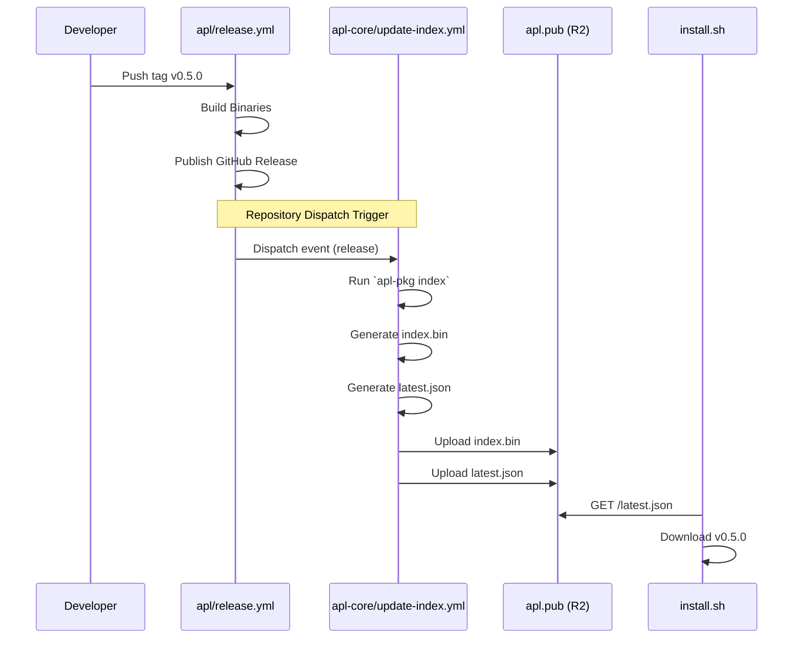

# Architecture

Technical overview of APL's internal design.

## Design Philosophy

APL is built around three principles:

1. **Speed** - Sub-second installs via streaming pipelines and binary indexes
2. **Simplicity** - TOML packages, no DSLs, minimal dependencies
3. **Safety** - SHA-256 verification, atomic installs, version history

---

## High-Level Architecture

```
┌─────────────────────────────────────┐
│         CLI Layer (main.rs)         │
│         Command Handlers            │
└──────────────┬──────────────────────┘
               │
┌──────────────┴──────────────────────┐
│      Operations (ops/)              │
│   install, remove, switch, flow     │
└──────────────┬──────────────────────┘
               │
┌──────────────┴──────────────────────┐
│       Core Modules (core/)          │
│   index, package, resolver,         │
│   relinker, builder, sysroot        │
└──────────────┬──────────────────────┘
               │
┌──────────────┴──────────────────────┐
│      I/O Layer (io/)                │
│   download, extract, dmg            │
└──────────────┬──────────────────────┘
               │
┌──────────────┴──────────────────────┘
│    Storage Layer (store/)           │
│   SQLite state, cache, CAS store    │
└─────────────────────────────────────┘
```

---

## Module Overview

### Core (`src/core/`)

| Module | Purpose |
|--------|---------|
| `index.rs` | Memory-mapped binary index with O(1) lookups |
| `package.rs` | TOML package parsing and validation |
| `resolver.rs` | Dependency resolution via topological sort |
| `relinker.rs` | Mach-O binary patching for portability |
| `builder.rs` | Source build orchestration |
| `sysroot.rs` | APFS COW isolation for builds |
| `version.rs` | Semantic version parsing |

### Operations (`src/ops/`)

| Module | Purpose |
|--------|---------|
| `install.rs` | Full installation pipeline |
| `remove.rs` | Package removal and cleanup |
| `switch.rs` | Version switching |
| `flow.rs` | Resolve → Download → Extract pipeline |
| `resolve.rs` | Project manifest dependency solver (semver) |

### I/O (`src/io/`)

| Module | Purpose |
|--------|---------|
| `download.rs` | HTTP streaming with concurrent chunks |
| `extract.rs` | Archive extraction (tar, zip, zstd) |
| `dmg.rs` | macOS disk image mounting |

### Storage (`src/store/`)

| Module | Purpose |
|--------|---------|
| `db.rs` | SQLite state management |
| `actor.rs` | Async database operations |
| `history.rs` | Version history tracking |

### UI (`src/ui/`)

| Module | Purpose |
|--------|---------|
| `output.rs` | High-level output API |
| `actor.rs` | Message-passing UI thread |
| `table.rs` | Progress table rendering |
| `reporter.rs` | Trait for progress reporting |

---

## Data Flow

### Installation Pipeline

```
1. Index Lookup
   ~/.apl/cache/index (MMAP) → find("ripgrep") → VersionInfo

2. Download + Extract (Streaming)
   HTTP Stream ─┬─→ Cache File
                ├─→ SHA-256 Hasher
                └─→ Decompressor → Tar/Zip Unpack

3. Installation
   Temp extraction → ~/.apl/store/ripgrep/14.1.1/

4. Linking
   ~/.apl/store/.../bin/rg → ~/.apl/bin/rg (symlink)

5. Database Update
   StateDb.install_package(name, version, sha256, files)
```

### UI Event Flow

```
┌─────────────┐
│ Install Cmd │──────┐
│ Remove Cmd  │      │  Reporter trait
│ Upgrade Cmd │      │
└─────────────┘      ▼
              ┌─────────────┐
              │   Output    │  Sends UiEvent
              └──────┬──────┘
                     │ mpsc channel
                     ▼
              ┌─────────────┐
              │  UI Actor   │  Single thread
              └──────┬──────┘
                     │
                     ▼
              ┌─────────────┐
              │  Terminal   │  Sequential output
              └─────────────┘
```

---

### Algorithmic Registry

The package registry is now **algorithmic**, meaning it uses templates to dynamically discover versions rather than requiring manual updates for every release.

- **Storage**: Templates are sharded in `registry/{prefix}/{name}.toml`.
- **Discovery**: The `apl-pkg` tool uses the GitHub Tags API to find all historical versions matching a `tag_pattern`.
- **Hydration**: For each discovered version, APL constructs download URLs and fetches integrity hashes (prioritizing vendor checksum files).

### Hydration Pipeline
To generate the binary index, APL runs a hydration pipeline that now supports two strategies:

#### Strategy A: Vendor Binaries (Fast path)
1. **GitHub Discovery**: Scan tags via API.
2. **Checksum Fetching**: Fetch vendor-provided checksums (avoiding full download).
3. **Fallback Hashing**: If checksums are missing, download once, hash, and cache.

#### Strategy B: Source Hydration (The "Chain")
When a package sets `build = true` (e.g., Ruby, OpenSSL), APL becomes a build system:
1. **Dependency Resolution**: Recursively builds dependencies (e.g., Ruby -> OpenSSL -> ...).
2. **CoW Build Environment**: Each build happens in a fresh APFS clonefile sysroot.
3. **Dependency Mounting**: Dependencies are mounted into the sysroot at `/deps/{name}`.
4. **Compilation**: The `script` runs (e.g., `./configure --with-openssl-dir=/deps/openssl`).
5. **Artifact Storage**: The result is bundled (`tar.zst`), hashed (SHA256), and uploaded to the R2-backed **Artifact Store**.
6. **Index Entry**: The package is added to the index pointing to the R2 URL (`apl.pub/cas/<hash>`).

This allows APL to distribute binaries for tools that don't provide them officially, while maintaining a pure, reproducible chain.

### Binary Index

The package index uses [Postcard](https://docs.rs/postcard) serialization with Zstd compression and memory mapping:

- **Load time**: <1ms (no parsing, just mmap)
- **Size**: ~2KB for 100 packages (pre-compression)
- **Lookups**: O(log n) binary search via memory-mapped slices.

### Streaming Extraction

Downloads are extracted on-the-fly without writing intermediate files:

```rust
HTTP Response → AsyncRead → Decompressor → Tar Entries → Filesystem
                    ↳ SHA-256 Hasher (parallel verification)
```

### Mach-O Relinker

macOS binaries hardcode library paths. APL patches them for portability:

```rust
// Before: dyld will fail if moved
@rpath/../lib/libfoo.dylib

// After: works anywhere
@executable_path/../lib/libfoo.dylib
```

Uses `install_name_tool` and `codesign -f -s -` for ad-hoc signing.

### APFS Clonefile

Source builds use macOS APFS copy-on-write for fast, isolated build roots:

```rust
// Near-instant directory copy
clonefile(source, build_root);
```

---

## Project Context

APL includes experimental support for project-local environments (similar to `nix-shell`):

- **Manifest (`apl.toml`)**: Declares project dependency requirements (semver ranges).
- **Lockfile (`apl.lock`)**: Pin exact versions and timestamps.
- **Ephemeral Shell (`apl shell`)**: Creates a temporary `Sysroot`, mounts requested packages, and spawns a shell with strict `PATH`.

### Asset Strings

APL uses a heuristic `AssetPattern` matcher (`src/core/asset_pattern.rs`) to map loose release filenames (e.g. `foo-macos-arm64.zip`) to strict architecture/OS variants.

---

## Storage Layout

```
~/.apl/
├── bin/                    # Symlinks to active binaries
│   ├── rg → ../store/ripgrep/14.1.1/rg
│   └── fd → ../store/fd/10.2.0/fd
├── store/                  # Installed packages
│   ├── ripgrep/
│   │   └── 14.1.1/
│   │       ├── rg
│   │       └── .apl-meta.json
│   └── fd/
│       └── 10.2.0/
├── cache/                  # Downloaded archives
├── logs/                   # Build logs
├── tmp/                    # Temporary extraction
├── index                   # Package index
└── state.db                # SQLite database
```

---

## Database Schema

```sql
-- Installed packages
packages (
    name TEXT,
    version TEXT,
    sha256 TEXT,
    active BOOLEAN,
    installed_at DATETIME,
    size_bytes INTEGER
)

-- File ownership
installed_files (
    path TEXT,
    package TEXT,
    sha256 TEXT
)

-- Version history
history (
    package TEXT,
    action TEXT,
    from_version TEXT,
    to_version TEXT,
    timestamp DATETIME
)
```

---

## Performance Characteristics

| Operation | Time | Notes |
|-----------|------|-------|
| Index load | <1ms | Memory-mapped |
| Package lookup | <0.1ms | O(log n) binary search |
| Small package install | ~2s | 6MB binary |
| Large package install | ~10s | 100MB+ |
| Index update | <1s | 15KB download |

---

## Security Model

| Feature | Implementation |
|---------|----------------|
| Hash verification | SHA-256 |
| Transport | HTTPS only with HSTS |
| Index Integrity | Ed25519 Detached Signature (Strict verification) |
| Verification timing | During download (no TOCTOU) |
| Audit trail | SQLite history table |
| Code signing | Ad-hoc re-signing after relinking |

## Release Pipeline Architecture

To ensure the install script always sees the latest release immediately, we use a unified signal flow between the binary repository (`apl`) and the registry repository (`apl-core`).


