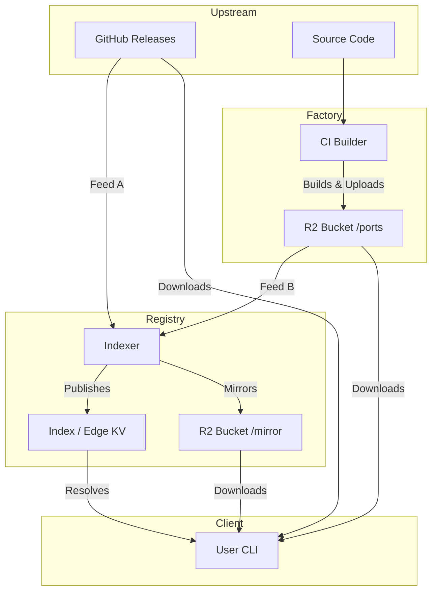

# Ecosystem Architecture

This document defines the high-level architecture of the APL ecosystem, which is composed of three distinct repositories interacting in a unidirectional pipeline.

## Overview

The system is designed to provide a strictly **binary-only** package management experience. It achieves this by decoupling the *building* of artifacts from the *indexing* of artifacts, and ensuring the client is a lightweight consumer of pre-verified data.

### Repositories

| Repository | Role | Responsibility |
| :--- | :--- | :--- |
| **`apl-ports`** | **Producer** | Maintains build recipes and runs CI jobs to compile hermetic binaries ("Ports") for source-only packages. Uploads artifacts to R2. |
| **`apl-packages`** | **Registry** | Contains package TOML templates. CI runs `apl-pkg` to aggregate artifacts from GitHub Releases into a unified Index. |
| **`apl`** | **Consumer** | The end-user CLI. Resolves packages via the Index/API and downloads verified artifacts. Never compiles from source. |

## Data Flow

## Component Details

### 1. apl-ports (The Producer)

This repository serves as the build farm for packages that do not provide upstream static binaries for macOS (e.g., Ruby, Python, FFmpeg).

*   **Constraint:** Builds must be hermetic and relocatable.
*   **Infrastructure:** GitHub Actions (macOS runners).
*   **Output:** Compressed tarballs ("Ports") uploaded to the R2 Content Addressable Store (CAS).

**Interaction:** This component shares no code with the others. It blindly produces artifacts to a storage bucket (`r2.apl.pub/ports`).

### 2. apl-packages (The Registry)

This repository maintains the state of the package universe. It is responsible for discovery, verification, and indexing.

*   **Inputs:**
    1.  **Discovery Feed:** Scrapes GitHub GraphQL API for upstream releases (95% of packages).
    2.  **Ports Feed:** Scans the `apl.pub/ports` bucket for artifacts built by `apl-ports` (5% of packages).
*   **Indexing strategy:**
    *   Treats "Ports" and "Upstream Releases" identically: they are just valid URLs with SHA256 hashes.
    *   Generates the static `index` file and populates the Edge KV store.
*   **Outputs:** The public Registry Index.

### 3. apl (The Client)

The CLI tool installed on user machines. It allows for "dumb", fast execution by offloading resolution logic to the Registry.

*   **Constraint:** No local build toolchain required.
*   **Resolution Path:**
    1.  Queries the Edge API (fast path).
    2.  Falls back to a locally cached `index` file (offline path).
*   **Execution:** Downloads, verifies checksum, extracts to `~/.apl/store`, and symlinks binaries.

## Storage Layout (R2)

To ensure deduplication and data integrity, the storage layer uses a CAS structure:

*   `/blobs/sha256/<hash>`: Immutable storage for all binary artifacts.
*   `/ports/<package>/<version>/<arch>.json`: Metadata pointer created by `apl-ports`.
*   `/index`: The global binary index generated from `apl-packages`.

## Recipe vs. Registry Definitions

A common point of confusion is the existence of two definitions for a single package (e.g., `ruby`).

1.  **Recipe (`apl-ports/ruby/port.toml`)**
    *   Defines *how to build* the software (compiler flags, source URL).
    *   Used only by the CI systems in `apl-ports`.
2.  **Pointer (`apl-packages/registry/ruby.toml`)**
    *   Defines *how to find* the artifact.
    *   Points to the R2 URL generated by the build process.
    *   Used by the Indexer to populate the user-facing index.
