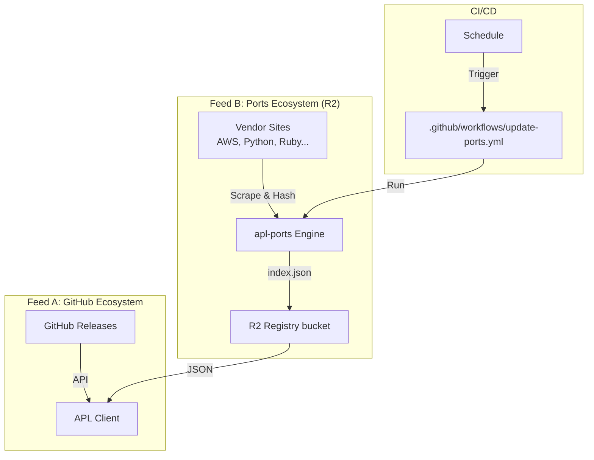

# Pipeline Architecture

APL utilizes a **Dual Feed Architecture** to ensure robust package availability.

## High-Level Flow

## Components

### 1. Feed A: GitHub
For tools distributed via GitHub Releases (e.g., `ripgrep`, `jq`), the APL Client queries GitHub directly (or a mirrored index). This provides immediate access to updates.

### 2. Feed B: Ports (Unified Rust Ecosystem)
For tools distributed via other means (e.g., `aws` pkg, `python` source), we use the **Ports Ecosystem**:

1.  **Declarative `port.toml`**: Defines the strategy (e.g., `hashicorp`, `aws`) and package metadata.
2.  **The Engine (`apl-ports`)**:
    *   Reads `port.toml`.
    *   Executes the Strategy (fetching versions, calculating SHA256).
    *   **Validates** artifacts (must have SHA256, valid URL).
    *   Uploads a standardized `index.json` to Cloudflare R2.
3.  **The Client (`apl`)**:
    *   Configured via `DiscoveryConfig::Ports`.
    *   Fetches `https://bucket/ports/<name>/index.json`.
    *   Treats these artifacts as first-class citizens.

## Infrastructure

- **Bucket**: `apl-store` (R2)
- **Engine Output**: `ports/<package>/index.json`
- **Validation**: Enforced at the Engine level. Invalid artifacts never reach the index.
