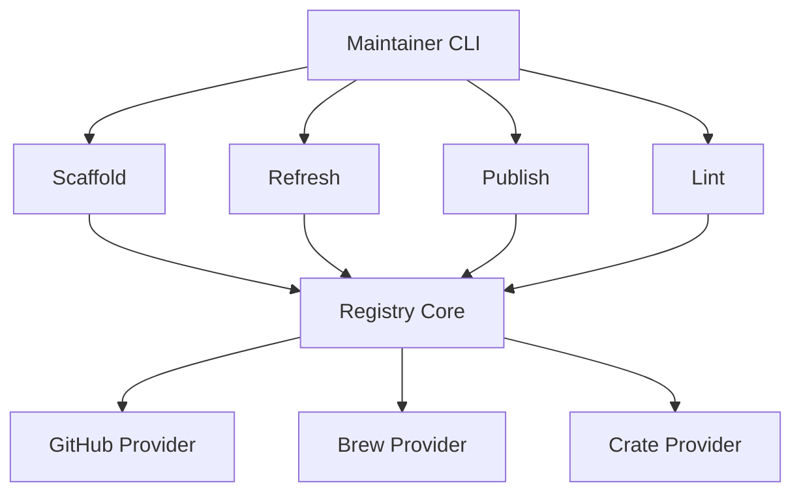

# Registry Management Architecture

## Current State Analysis
Maintenance tasks are consolidated into the `apl-pkg` tool.

### Unified Registry Maintainer (`apl-pkg`)

The registry follows a centralized architecture for managing the lifecycle of packages.

### 1. Unified Architecture

### 2. Core Components
- **`Registry Core` (`src/registry/mod.rs`)**: Shared logic for package validation, TOML parsing, and client building.
- **`GitHub Provider` (`src/registry/github.rs`)**: Intelligent asset detection patterns for macOS ARM64 binaries (handles raw binaries and various archive naming conventions).
- **`Linter`**: Integrated into `apl-pkg check` to catch errors like `0.0.0` versions or missing fields.

### 3. Command Structure
| Command | Action |
|---------|--------|
| `apl-pkg add <owner/repo>` | Intelligent scaffolding from GitHub releases. |
| `apl-pkg update [--package <name>]` | Version refresh for existing TOMLs + Index regeneration. |
| `apl-pkg index` | Manually generates `index.bin` from TOMLs. |
| `apl-pkg check` | Validation/Linting (pre-commit check). |
