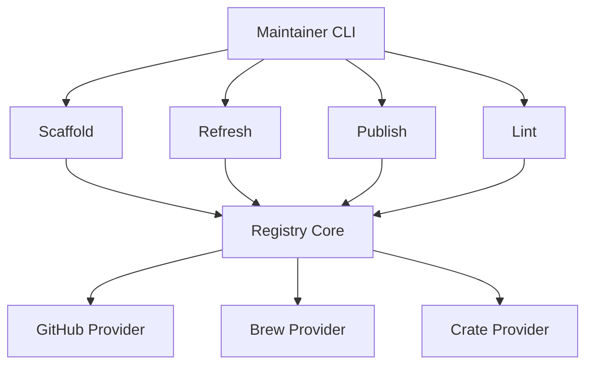

# Registry Management Architecture

## Overview
The APL registry maintenance is consolidated into the `apl-pkg` utility, which manages the entire lifecycle of package definitions.

### Unified Registry Maintainer (`apl-pkg`)

The tool utilizes a modular architecture to handle different aspects of registry maintenance.

### 1. Unified Architecture

### 2. Core Components
- **Registry Core (`src/registry/mod.rs`)**: Shared logic for package validation, TOML parsing, and HTTP client management.
- **GitHub Provider (`src/registry/github.rs`)**: Intelligent asset detection patterns for macOS ARM64 binaries. It supports raw executable binaries and multiple archive naming conventions.
- **Integrity Linter**: Integrated into the `check` command to identify structural errors, invalid versions, or missing metadata.

### 3. Primary Commands
| Command | Action |
|---------|--------|
| `apl-pkg add` | Automated scaffolding from GitHub releases. |
| `apl-pkg update` | Global version synchronization and index regeneration. |
| `apl-pkg index` | Manual generation of the compressed `index.bin`. |
| `apl-pkg check` | Automated registry validation and linting. |
